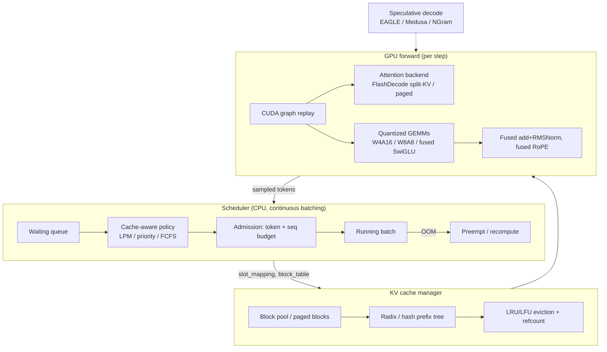

# Inference-Engine Optimization Catalog — vLLM, SGLang, TensorRT-LLM, FlashAttention & FlashInfer

**Purpose:** Catalog *every* optimization implemented by the major open-source LLM
serving engines so they can be adapted into a from-scratch PyTorch + Triton
Llama-3.1-8B decode engine (single RTX 6000 Ada, 48 GB). Each item lists the
mechanism, *why* it helps (with emphasis on the memory-bandwidth-bound decode
regime), and source file citations.

**Repositories & commits studied**
- vLLM — [vllm-project/vllm](https://github.com/vllm-project/vllm) @ `f0204358d9b811bde5320c037236e97b8fb6199d`
- SGLang — [sgl-project/sglang](https://github.com/sgl-project/sglang) @ `aa510bda4505ee29216d99ca414cf9fc6b6ab53e`
- TensorRT-LLM — [NVIDIA/TensorRT-LLM](https://github.com/NVIDIA/TensorRT-LLM) @ `e94830c5157a4be9928ba04c00c406ea660e844f`
- FlashAttention — [Dao-AILab/flash-attention](https://github.com/Dao-AILab/flash-attention) @ `b02b07e1a10238fe12831b80a8937ed59b1353a5`
- FlashInfer — [flashinfer-ai/flashinfer](https://github.com/flashinfer-ai/flashinfer) @ `0037a9c11f3cdff3731193a10dbd91ce77daaa7f`

---

## Executive Summary

Every optimization in these engines reduces to one of three levers, and at
**decode time (the memory-bandwidth-bound regime)** the first lever dominates:
**(1) move fewer bytes** (weight/KV quantization, fused kernels that collapse
memory passes, paged & shared KV cache), **(2) raise arithmetic intensity**
(fused dequant-GEMM, tiled online-softmax attention), and **(3) hide latency**
(CUDA graphs, async copy pipelines, overlap scheduling). The single highest-impact
levers for a single-GPU Llama-3.1-8B decode engine are: a **split-KV FlashDecoding
attention kernel**, **weight-only INT4/INT8 GEMM** for the MLP, **CUDA-graph
capture of the decode step**, a **paged KV cache** to unlock larger batches, and
**prefix/radix KV reuse**. This report documents 40+ distinct techniques with
citations and a prioritized adoption plan.[^1][^2][^3][^4][^5]

---

## Architecture Overview — How the Pieces Fit



---

## Cross-Engine Comparison Table

| Optimization | vLLM | SGLang | TensorRT-LLM | Flash*/Infer |
|---|---|---|---|---|
| Paged KV cache | `BlockPool` (v1) | `TokenToKVPool` | `BlockManager` | `paged_kv_t` |
| Prefix reuse | hash-chain APC | **RadixAttention** tree | radix tree + host offload | cascade attn |
| Continuous batching | iteration-level sched | `ScheduleBatch` mixins | in-flight batching | n/a |
| Chunked prefill | yes | yes (`MIXED` mode) | yes (block-aligned) | n/a |
| CUDA graphs | FULL + PIECEWISE | bucketed + piecewise | `CudaGraphExecutorCache` | plan/run reuse |
| Decode attn kernel | PagedAttn v1/v2 | FlashInfer/Triton | **XQA** | **FlashDecode split-KV** |
| Weight-only quant | Marlin/Machete W4/W8 | Marlin/AWQ/GPTQ | `fpA_intB` + GEMV | n/a |
| Activation quant | FP8/INT8 W8A8 | FP8/INT8 | FP8/INT8 SmoothQuant | FP8 (FA3) |
| FP8 KV cache | yes | `k_scale`/`v_scale` | `fp8KvCache` | E4M3 paged |
| Fused norm/RoPE/act | CUDA kernels | yes | plugins + in-XQA RoPE | n/a |
| Speculative decode | spec tokens in sched | **EAGLE/EAGLE3/NGram** | EAGLE3/MTP/Medusa/PARD | n/a |
| Overlap scheduling | async scheduler | **FutureMap zero-overhead** | — | — |

---

# 1. KV Cache Management

## 1.1 Paged KV Cache (vLLM PagedAttention, SGLang pools, TRT-LLM BlockManager)
**Mechanism.** Store KV in fixed-size blocks (pages) of `block_size` tokens
(default 16) drawn from a flat pre-allocated GPU pool, instead of one contiguous
per-request buffer. A per-request **block table** maps logical token positions to
physical block ids; a `slot_mapping` (computed by a Triton kernel) gives the exact
write offset per token.[^1]
**Why.** Eliminates internal fragmentation (only the last block is partial),
enables cross-request sharing via refcounts, and allows fine-grained preemption.
This is what lets long-prompt flavors batch higher without pre-reserving
`max_seq_len` per request — directly relevant to raising the aggregate-throughput
ceiling. vLLM v1 data structures: `KVCacheBlock`, the O(1) doubly-linked
`FreeKVCacheBlockQueue` LRU, `BlockPool`, and a Triton `_compute_slot_mapping_kernel`.[^1]
TRT-LLM uses `tokens_per_block` power-of-2 blocks with separate pools per KV-head
group for GQA.[^3]

## 1.2 Prefix Reuse — Hash-Chain (vLLM APC) vs Radix Tree (SGLang RadixAttention)
**vLLM APC.** Each full block gets a **chain hash** `hash(parent_hash, tokens,
extra_keys)`; changing any earlier token invalidates all later block hashes.
Lookup walks `block_hashes` and reuses the longest cached prefix, skipping its
prefill entirely. Extra keys isolate LoRA / multimodal / `cache_salt`.[^1]
**SGLang RadixAttention (the signature optimization).** KV blocks live in a
**radix (compressed-prefix) tree** keyed by token ids. `match_prefix` does an O(L)
longest-prefix walk; a partial hit **splits a node** (O(1) structural surgery, no
data copy). `cache_finished_req` inserts the full `(input+output)` sequence and
frees duplicated slots. Eviction is a pluggable min-heap (`lru` default, plus
`lfu/fifo/mru/slru/priority`) over `lock_ref==0` leaves; active requests hold a
lock walked to the root.[^2]
**Why.** Repeated system prompts, multi-turn chat, and RAG contexts reuse KV
verbatim — eliminating redundant prefill compute and raising effective batch.
TRT-LLM adds **prioritized LRU** (priority 0–100, default 35), **copy-on-write**
for beam divergence, **partial block reuse**, and **host (CPU) offload** of blocks
before eviction.[^3]

## 1.3 Cache-Aware & In-Batch Scheduling (SGLang)
`SchedulePolicy` reorders the waiting queue by **Longest-Prefix-Match** (`lpm`,
degrades to FCFS past 128 queued) or **`dfs-weight`** (co-schedules requests
sharing deep tree paths). A *second simulated radix tree* over the waiting queue
detects requests that share a prefix with *each other* and deprioritizes
duplicates so the first builds the cache entry before the rest run.[^2]

## 1.4 FP8 KV Cache (all engines)
Store K/V as FP8 E4M3 (1 byte) with per-tensor (or per-token-head) scales; the
attention kernel dequantizes on read. Halves KV VRAM → ~2× batch/context at
negligible accuracy cost. vLLM `kv_cache.py`; TRT-LLM `fp8KvCache` bit with
`kv_scale_orig_quant`/`kv_scale_quant_orig` handled inside XQA with zero extra
launches.[^4][^3]

## 1.5 Hybrid / Multi-Group Blocks, Zeroing, Events
vLLM supports differing block sizes per layer-group (`MultiGroupBlockTable`),
optional block **zeroing** for quantized KV formats, and KV-event publishing for
P/D disaggregation/offload connectors.[^1]

---

# 2. Scheduling & Batching

## 2.1 Continuous / Iteration-Level Batching (vLLM v1, TRT-LLM in-flight)
No separate "prefill phase" vs "decode phase": each request just has
`num_computed_tokens` to advance toward `num_tokens_with_spec`. Every step packs
any mix of new prefills, chunked prefills, and decodes up to
`max_num_batched_tokens` (default 2048) and `max_num_seqs` (default 128). Finished
requests leave immediately; new ones join next step. Sequences are packed with no
padding; context sequences ordered before generation.[^1][^3]

## 2.2 Chunked Prefill
Split long prompts into ≤`long_prefill_token_threshold` chunks so one long prompt
can't monopolize the GPU and starve concurrent decodes. Non-final chunks discard
their sampled token. `scheduler_reserve_full_isl` only admits if the *whole*
sequence will fit, preventing mid-prefill thrash. TRT-LLM requires chunks aligned
to `tokens_per_block`.[^1][^3]

## 2.3 Preemption / Recompute vs Swap
vLLM **v1 dropped CPU swapping** — on OOM it frees a victim's KV and re-queues it
for full re-prefill (cheap when APC still holds its blocks). FCFS preempts the
youngest running request; priority mode preempts lowest-priority/latest-arrival.[^1]

## 2.4 Overlap Scheduling — Zero-Overhead Scheduler (SGLang) & Async (vLLM)
SGLang's **`FutureMap`** pipelines CPU scheduling of step N+1 with GPU execution of
step N: the sampler writes sampled tokens / new seq-lens into pool-indexed GPU
buffers; the scheduler resolves the next batch's inputs from those buffers without
a CPU↔GPU sync. A private D2H stream gated on a CUDA event copies only the
seq-lens the CPU truly needs. **Two-Batch Overlap (TBO)** runs two micro-batches
on separate streams to overlap compute and memory. vLLM has an analogous
`AsyncScheduler` using GPU-resident `prev_sampled_token_ids`.[^2][^1]

---

# 3. Attention Kernels (the decode-critical path)

## 3.1 FlashAttention Core — Tiling + Online Softmax
Never materialize the N×N score matrix. Tile Q into `kBlockM` rows, stream K/V in
`kBlockN` tiles, keep a running `(m, d, o)` in registers. The **online-softmax**
update on a new tile:
```
m_new = max(m_prev, max_j s_j)
α     = exp2(m_prev - m_new)                # rescale factor for old state
d_new = d_prev·α + Σ exp2(s_j - m_new)
o_new = o_prev·α + Σ exp2(s_j - m_new)·v_j
```
Uses **base-2 exp** (`exp2`) so `s·scale_log2 - m_scaled` collapses to one FMA and
maps to the `ex2.approx.f32` PTX instruction. The backward pass stores only the
log-sum-exp (one float/row) and **recomputes** S, trading HBM traffic for FLOPs.[^5]

## 3.2 FlashAttention-2 / 3 Refinements
FA2: defer the `1/d` normalization to a single `finalize()`, defer cross-thread
warp reduction out of the inner loop, and have all warps cooperate on **one** Q
block (K/V loaded to SRAM once, not per-warp). Grid parallelizes over Q-tiles ×
heads × batch. FA3 (Hopper): **producer/consumer warp specialization** (TMA-load
warpgroup feeds WGMMA-compute warpgroups via async pipeline), softmax interleaved
with WGMMA, FP8 with a `Max_offset=8` exp2 trick to curb FP8 underflow, and a
**persistent tile scheduler** that fills all SMs.[^5]

## 3.3 FlashDecoding / Split-KV — *the* single-query decode lever
**Problem.** Batch-1 decode with 32 heads gives only 32 threadblocks → most SMs
idle; the bottleneck is low *KV-sequence* parallelism, not Q parallelism.
**Fix.** Split the KV sequence into `num_splits` chunks, each computed by its own
threadblock producing a partial `(O, lse)`, then a combine kernel merges them via
the same online-softmax `merge()`. FlashInfer decides `split_kv` **automatically**
using `cudaOccupancyMaxActiveBlocksPerMultiprocessor` + a binary search to size
pages-per-batch so `batch·heads·splits ≈ all SMs`.[^5]
**For our engine (head_dim=128, 32 Q / 8 KV heads):** with ~140 SMs target
`8 KV-heads × splits ≈ SM count`; split a long KV cache ~14–16 ways at batch 1.

## 3.4 Paged Attention Kernels (vLLM v1/v2, FlashInfer, TRT-LLM XQA)
- **vLLM PagedAttention v1**: one block per (head, seq), single-pass online
  softmax; KV laid out `[blocks, kv_heads, head/x, block, x]` for 128-bit loads.
  **v2**: partitions KV (`PARTITION_SIZE=512`) across the grid z-dim + a reduce
  kernel — wins on long sequences (this is split-KV by another name).[^4]
- **FlashInfer `paged_kv_t`**: `indptr` (CSR per-request page ranges), `indices`
  (virtual→physical page map), `last_page_len`; `uint_fastdiv` page size for
  branchless modulo; double-buffered `cp.async` prefetch of K/V tiles; a
  **plan/run** split where `plan()` computes the split/schedule on CPU once and
  `run()` replays each step (graph-friendly).[^5]
- **TRT-LLM XQA**: a decode-specialized kernel (NVRTC-JIT'd per
  `head_size/GQA-ratio/page-size/dtype` hash key) with **multi-block mode**
  (split-K analogue) kicking in past `kMinHistoryTokensPerBlock=128`, and **RoPE +
  FP8 KV dequant fused inside** the kernel.[^3]

## 3.5 Cascade / Common-Prefix Attention
Compute attention over a shared prefix once → `(O_prefix, lse_prefix)`, compute
per-request suffix, then merge states. vLLM reports `num_common_prefix_blocks`;
FlashInfer provides `MergeStateKernel`. Pairs naturally with prefix-cache reuse.[^4][^5]

---

# 4. Quantization (the weight-byte lever for decode)

## 4.1 Weight-Only INT4/INT8 (W4A16 / W8A16) — highest decode value
Store weights at 4/8 bits with per-channel (or per-group g=128) scales; dequant
on-the-fly inside the GEMM. At decode M is tiny so the GEMM is **bound on the
weight read** — fewer weight bytes ≈ proportionally faster. Implementations:
- **Marlin** (SM70–89): `cp.async` 4-stage pipeline prefetching weight tiles to
  SRAM while tensor cores compute; weights repacked to 16×16 HMMA tiles at load.
  Supports W4A16, W8A16, W4A8.[^4]
- **Machete** (SM90): CUTLASS-3 WGMMA + TMA persistent warp-specialized successor.[^4]
- **TRT-LLM `CutlassFpAIntBGemmRunner`** + a custom **`weightOnlyBatchedGemv`** for
  M≤16 that streams INT4/INT8 weights and dequantizes in registers — the optimal
  decode path; offline `GemmPluginProfiler` picks tiling.[^3]
- **AWQ** protects salient weights by per-channel activation scaling before INT4
  quant; **GPTQ** is the alternative. vLLM/SGLang dispatch both via Marlin.[^4][^2]
**Rule of thumb:** weight-only wins at small M (decode); W8A8/FP8 wins at large M
(prefill/big batch) where tensor-core throughput dominates.[^4]

## 4.2 Activation Quant — FP8 & INT8 W8A8 (SmoothQuant)
FP8 E4M3 weights+activations via CUTLASS scaled-MM (2× FP16 tensor-core throughput
on Hopper). INT8 W8A8 via SmoothQuant: migrate per-channel activation outliers
into the weights (`s_c = max|X_c|^α / max|W_c|^{1-α}`) so both quantize cleanly;
CUTLASS `mma.s8` INT32-accumulate. Static or dynamic (per-token) activation
scales.[^4][^3]

## 4.3 Broader Menu
vLLM/SGLang also ship GGUF (llama.cpp K-quants), bitsandbytes NF4/INT8,
compressed-tensors, MoE weight-only (`MoeWNA16`), and MXFP4/NVFP4 for Blackwell.
TRT-LLM exposes a `QuantMode` bitfield combining weight/activation/KV schemes.[^4][^3]

---

# 5. Fused Kernels (collapse memory passes)

- **Fused Add + RMSNorm**: `x = norm(x + residual)` in one pass (2 HBM passes vs
  4); 128-bit packed loads. Every layer does this twice.[^4]
- **Fused RMSNorm + Quant**: norm output written already-quantized to FP8/INT8.[^4][^3]
- **Fused RoPE**: in-place `q·cos + rotate_half(q)·sin` from a precomputed
  cos/sin cache; NeoX & GPT-J styles, partial-RoPE, Llama-3 scaling. TRT-LLM fuses
  RoPE *inside* the attention kernel (no round-trip).[^4][^3]
- **Fused SiLU+Mul (SwiGLU)**: input `[T, 2H]` → gate·silu × up → `[T, H]`, one
  pass; `silu_and_mul` (+ block-quant variant that emits FP8/INT8 directly).[^4]
- **Fused gate+up GEMM** (vLLM "MergedColumnParallelLinear"; our `w_gate_up`):
  one larger GEMM beats two for tile utilization & launch overhead.[^4]
- **Fused gated GEMM (TRT-LLM `CutlassFusedGatedGemmRunner`)**: gate+up projection
  *and* SwiGLU in one CUTLASS kernel, halving intermediate traffic.[^3]
- **Mega-fusions**: TRT-LLM's DeepSeek-V4 kernel fuses QNorm+RoPE+KV-quant+cache
  insert (5+ launches → 1).[^3]

---

# 6. CUDA Graphs (kill launch overhead at decode)

Decode kernels are short and launch-overhead-dominated; capturing the forward pass
and replaying as one graph removes per-kernel CPU dispatch.
- **vLLM**: `FULL` graph for uniform decode (all reqs 1 token), `PIECEWISE` graph
  (attention left eager) for mixed prefill+decode. Captures a discrete set of
  **padded batch buckets** (`cudagraph_capture_sizes`), rounds runtime batch up to
  the next bucket, pads extra slots with `PAD_SLOT_ID=-1`; captures largest-first
  to share the memory pool.[^1]
- **SGLang**: power-of-2 batch buckets, static `DecodeInputBuffers`,
  `_grouped_foreach_copy_` to batch input copies, `BreakableCUDAGraph` /
  piecewise for non-capturable ops.[^2]
- **TRT-LLM**: `CudaGraphExecutorCache` (LRU keyed by batch state) with
  `cudaGraphExecUpdate` incremental re-instantiation; piecewise via torch.compile
  with eager attention.[^3]
**Graph-safety rules we already follow:** static shapes, device-scalar positions
/ kv-len, no Python-int slicing, attention kernel must read kv_len from a device
buffer. FlashInfer's plan/run split is explicitly designed so metadata is stable
across steps for graph capture.[^5][^1]

---

# 7. Speculative Decoding (compute-underutilized low batch)

Propose K tokens cheaply, verify K+1 in one target forward pass; accept the
longest consistent prefix → >1 token per target step.
- **SGLang EAGLE/EAGLE3**: draft head shares the target's embedding & lm_head;
  **hot-vocabulary** slicing of lm_head; tree candidates verified with a custom
  `tree_speculative_sampling_target_only` kernel; rejected KV slots freed;
  **adaptive** controller tunes steps×topk by observed acceptance; integrates with
  `FutureMap` for zero-overhead spec scheduling. Also NGram (model-free) & MTP.[^2]
- **TRT-LLM**: Draft/Target, EAGLE3 (dynamic tree), Medusa, NGram, MTP, PARD,
  Suffix-Automaton; XQA verifies draft trees via `spec_decoding_packed_mask`;
  `KVCacheUpdater` rewinds rejected tokens.[^3]

---

# 8. Distribution / Misc (lower priority for single-GPU)
Custom IPC all-reduce (peer P2P reads, faster than NCCL ring for TP≤8), QuickReduce
(quantized all-reduce, ROCm), fused all-reduce+RMSNorm, custom sampling/top-k
kernels (persistent top-k), P/D disaggregation, HiCache (GPU→CPU→SSD KV tiers), DP
attention, context parallelism, and grammar/jump-forward structured decoding
(skip forward passes through deterministic FSM states).[^4][^2]

---

## Prioritized Adoption Plan for the Triton Llama-3.1-8B Decode Engine

Ordered by expected aggregate-throughput impact given we already have a
CUDA-graphed decode step + fused RoPE/SwiGLU/flash-decode:

1. **Weight-only INT4/INT8 MLP GEMM (W4A16 first).** Decode is weight-bandwidth
   bound; MLP weights ≈70% of bytes/token. Now that the decode step is a captured
   graph, the extra Triton launches replay free (this is exactly the EXP11
   hypothesis). Use per-output-channel symmetric quant; consider group-size=128
   and INT4 for a bigger byte cut. Model after Marlin's `cp.async` pipeline and
   TRT-LLM's `weightOnlyBatchedGemv` for M≤16.[^4][^3]
2. **Split-KV in the flash-decode kernel.** Partition KV ~14–16 ways at batch 1 to
   fill SMs; combine partials via online-softmax merge. Auto-size splits from SM
   occupancy like FlashInfer.[^5]
3. **Paged KV cache + right-sized allocation.** Stop pre-reserving `max_seq_len`;
   block_size 16–32. Unlocks higher batches for long-prompt flavors → new higher
   aggregate-throughput cells (the headline is the MAX across the sweep).[^1][^3]
4. **Prefix/radix KV reuse.** Chain-hash (vLLM) or radix tree (SGLang) to skip
   shared-prefix prefill; big win on shared-prompt flavors.[^1][^2]
5. **FP8 KV cache.** Halve KV bytes → more batch/context; dequant in the flash
   kernel via per-tensor scales.[^4][^3]
6. **Fused add+RMSNorm** (if not already) and **fused gate+up+SwiGLU** GEMM to cut
   intermediate traffic.[^4][^3]
7. **Reduce per-step eager overhead**: fuse cos/sin/pos/kv-len device-buffer
   updates; FlashInfer-style stable metadata for the captured graph.[^5]
8. **Speculative decode (NGram first — model-free)** for low-batch latency, later
   EAGLE.[^2][^3]

---

## Confidence Assessment

- **High confidence (verified with file/line citations):** all KV-cache, scheduler,
  attention-kernel, quantization, fusion, CUDA-graph, and speculative-decode
  mechanisms documented above — each traced to specific files in the named repos
  at the pinned commits.
- **Medium confidence:** exact runtime speedups (engine-/shape-/hardware-dependent;
  numbers cited are the engines' own order-of-magnitude claims, not measured on our
  RTX 6000 Ada). The split-count and block-size recommendations are derived from SM
  occupancy reasoning and must be empirically tuned via the standalone-benchmark →
  profile loop.
- **Assumptions:** report scoped to the five most-relevant engines; LMDeploy/TGI/
  MLC were not separately dispatched (their key ideas — TurboMind paged attention,
  continuous batching, TVM-compiled kernels — overlap the techniques above). Some
  vLLM line numbers are approximate (`~`) where the source agent reported nearest
  anchors. Pin commits may drift from `main`.

---

## Footnotes

[^1]: vLLM core serving — [vllm/v1/core/kv_cache_utils.py](https://github.com/vllm-project/vllm/blob/f0204358d9b811bde5320c037236e97b8fb6199d/vllm/v1/core/kv_cache_utils.py), [vllm/v1/core/block_pool.py](https://github.com/vllm-project/vllm/blob/f0204358d9b811bde5320c037236e97b8fb6199d/vllm/v1/core/block_pool.py), [vllm/v1/core/sched/scheduler.py](https://github.com/vllm-project/vllm/blob/f0204358d9b811bde5320c037236e97b8fb6199d/vllm/v1/core/sched/scheduler.py), [vllm/v1/worker/block_table.py](https://github.com/vllm-project/vllm/blob/f0204358d9b811bde5320c037236e97b8fb6199d/vllm/v1/worker/block_table.py), [vllm/v1/cudagraph_dispatcher.py](https://github.com/vllm-project/vllm/blob/f0204358d9b811bde5320c037236e97b8fb6199d/vllm/v1/cudagraph_dispatcher.py).
[^2]: SGLang — [python/sglang/srt/mem_cache/radix_cache.py](https://github.com/sgl-project/sglang/blob/aa510bda4505ee29216d99ca414cf9fc6b6ab53e/python/sglang/srt/mem_cache/radix_cache.py), [python/sglang/srt/managers/schedule_policy.py](https://github.com/sgl-project/sglang/blob/aa510bda4505ee29216d99ca414cf9fc6b6ab53e/python/sglang/srt/managers/schedule_policy.py), [python/sglang/srt/managers/overlap_utils.py](https://github.com/sgl-project/sglang/blob/aa510bda4505ee29216d99ca414cf9fc6b6ab53e/python/sglang/srt/managers/overlap_utils.py), [python/sglang/srt/speculative/eagle_worker.py](https://github.com/sgl-project/sglang/blob/aa510bda4505ee29216d99ca414cf9fc6b6ab53e/python/sglang/srt/speculative/eagle_worker.py), [python/sglang/srt/model_executor/cuda_graph_runner.py](https://github.com/sgl-project/sglang/blob/aa510bda4505ee29216d99ca414cf9fc6b6ab53e/python/sglang/srt/model_executor/cuda_graph_runner.py).
[^3]: TensorRT-LLM — [cpp/include/tensorrt_llm/batch_manager/kvCacheManager.h](https://github.com/NVIDIA/TensorRT-LLM/blob/e94830c5157a4be9928ba04c00c406ea660e844f/cpp/include/tensorrt_llm/batch_manager/kvCacheManager.h), cpp/tensorrt_llm/kernels/decoderMaskedMultiheadAttention/ (XQA: decoderXQARunner.h, xqaParams.h), [cpp/tensorrt_llm/kernels/cutlass_kernels/fpA_intB_gemm/fpA_intB_gemm.h](https://github.com/NVIDIA/TensorRT-LLM/blob/e94830c5157a4be9928ba04c00c406ea660e844f/cpp/tensorrt_llm/kernels/cutlass_kernels/fpA_intB_gemm/fpA_intB_gemm.h), cpp/tensorrt_llm/batch_manager/utils/inflightBatchingUtils.cpp (`CudaGraphExecutor`), cpp/tensorrt_llm/kernels/weightOnlyBatchedGemv/.
[^4]: vLLM kernels & quant — [csrc/attention/attention_kernels.cuh](https://github.com/vllm-project/vllm/blob/f0204358d9b811bde5320c037236e97b8fb6199d/csrc/attention) (PagedAttention v1/v2), [vllm/model_executor/layers/quantization/fp8.py](https://github.com/vllm-project/vllm/blob/f0204358d9b811bde5320c037236e97b8fb6199d/vllm/model_executor/layers/quantization/fp8.py), csrc/quantization/marlin/marlin_template.h, csrc/quantization/machete/, [csrc/layernorm_kernels.cu](https://github.com/vllm-project/vllm/blob/f0204358d9b811bde5320c037236e97b8fb6199d/csrc) (fused add+RMSNorm), vllm/model_executor/layers/fused_moe/fused_moe.py.
[^5]: FlashAttention & FlashInfer — [csrc/flash_attn/src/flash_fwd_kernel.h](https://github.com/Dao-AILab/flash-attention/blob/b02b07e1a10238fe12831b80a8937ed59b1353a5/csrc/flash_attn/src/flash_fwd_kernel.h) (`compute_attn_1rowblock`, `compute_attn_1rowblock_splitkv`), hopper/softmax.h, hopper/flash_fwd_kernel_sm90.h; [include/flashinfer/attention/decode.cuh](https://github.com/flashinfer-ai/flashinfer/blob/0037a9c11f3cdff3731193a10dbd91ce77daaa7f/include/flashinfer/attention/decode.cuh), include/flashinfer/attention/scheduler.cuh (auto split-KV), include/flashinfer/page.cuh (`paged_kv_t`), include/flashinfer/attention/state.cuh (`state_t::merge`), include/flashinfer/attention/cascade.cuh.
